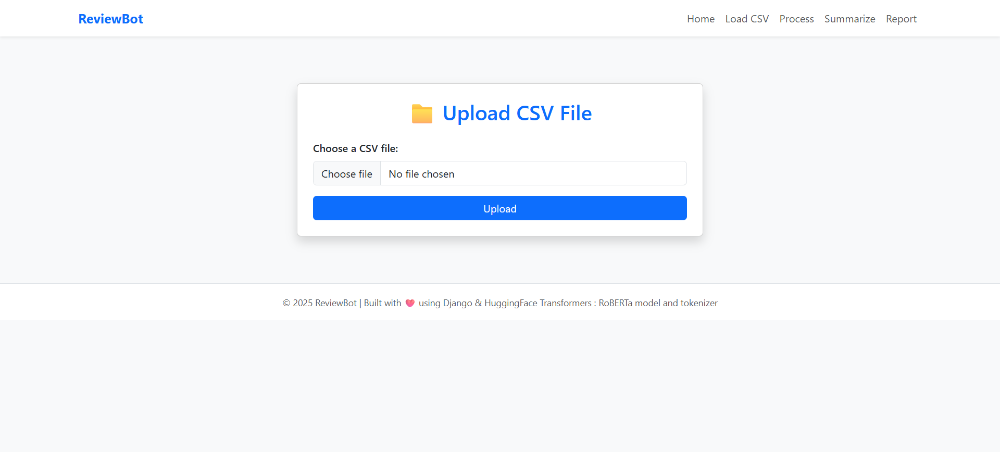
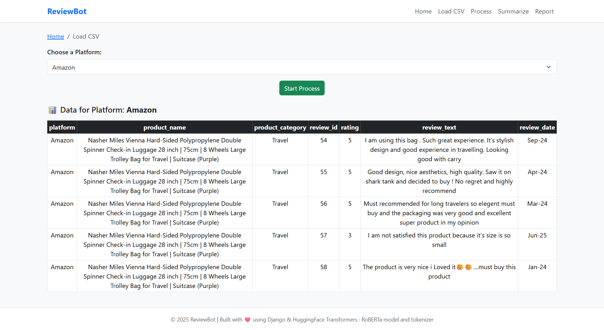
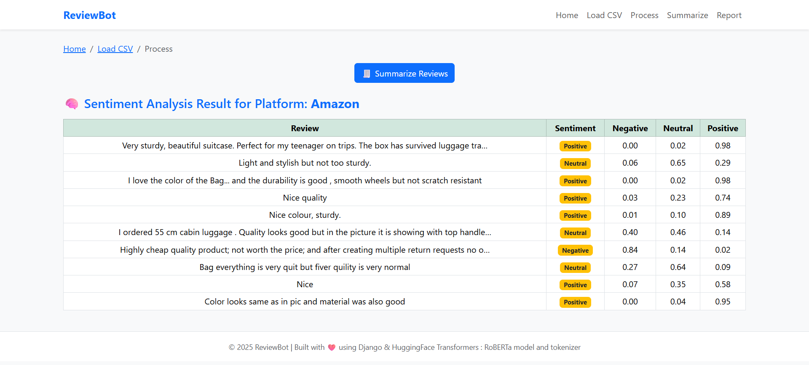
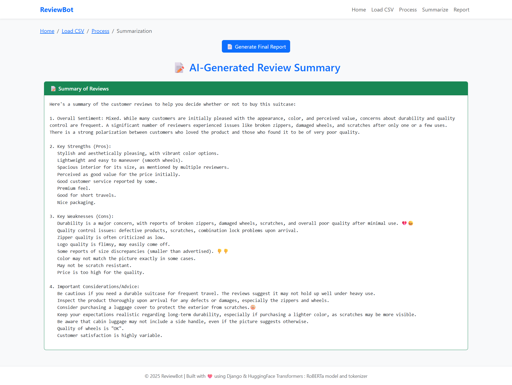
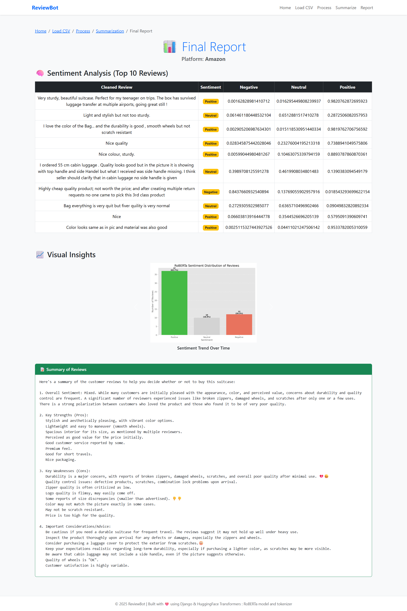
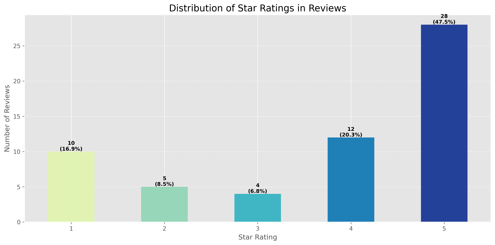
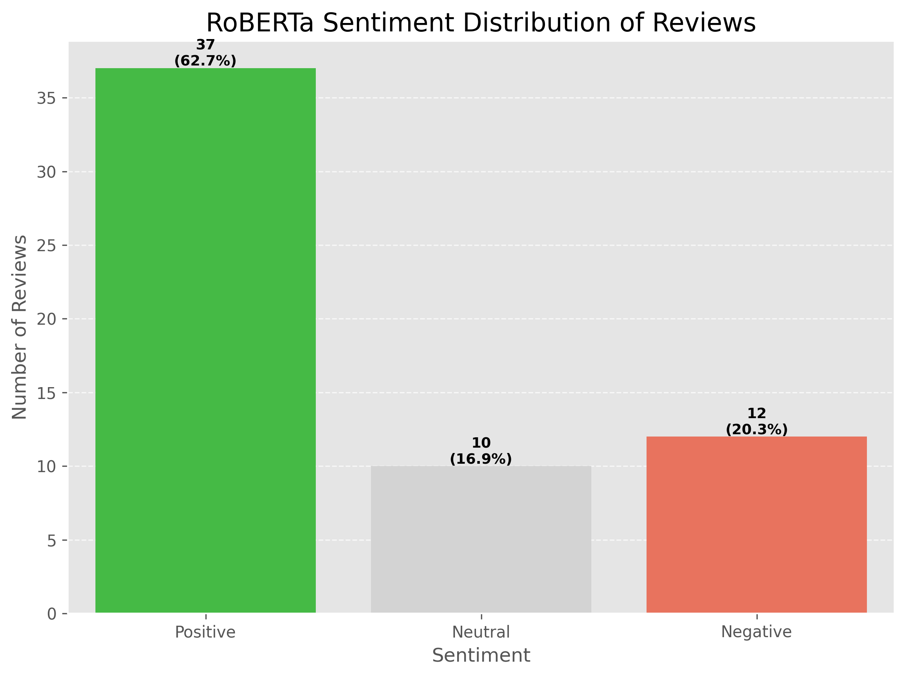
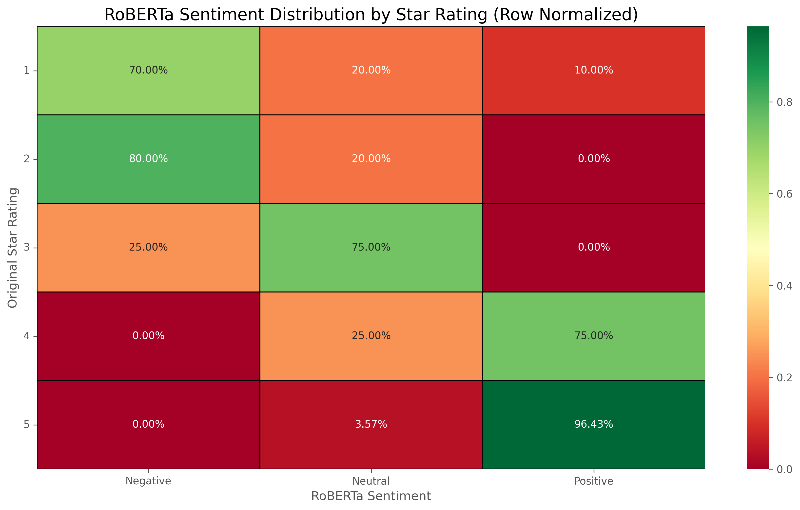

# 🧠 AI-Powered Sentiment Analysis & Summarization Web App

A Django-based AI web application that performs sentiment analysis and automatic summarization on user-uploaded datasets (CSV format). It uses state-of-the-art NLP models to analyze customer reviews, generate meaningful insights, and visualize results in an interactive final report.

---

## 🚀 Features

- 📤 **CSV Upload Interface**: Upload review datasets easily.
- 📊 **Sentiment Analysis**: Analyzes reviews using **RoBERTa**.
- 🧠 **Summarization**: Automatically generates summaries using NLP techniques.
- 📈 **Data Visualizations**: View sentiment distributions and heatmaps.
- 📝 **Final Report**: Consolidated report with graphs, summary, and insights.
- 🌐 **Web Interface**: Clean and responsive UI built with HTML & CSS.

---

## 🏗️ Project Structure

```text
AIproject/
│
├── AIproject/               # Django project configuration
│   ├── settings.py
│   ├── urls.py
│   ├── wsgi.py, asgi.py
│
├── core/                    # Main application logic
│   ├── views.py             # Request handling and data processing
│   ├── urls.py
│   ├── Sentiment/           # Sentiment analysis logic
│   │   ├── sentiment.py
│   │   └── generate_sentiment_graphs.py
│   ├── Summarization/       # Summarization logic
│   │   └── summarizer.py
│   └── Final_Report/        # (optional) Final report generator
│
├── templates/               # HTML templates
│   ├── index.html
│   ├── upload.html
│   ├── sentiment_output.html
│   ├── summarized.html
│   ├── final_report.html
│   └── main.html
│
├── static/
│   ├── style.css
│   └── sentiment_graphs/
│       ├── rating_distribution.png
│       ├── roberta_sentiment_distribution.png
│       └── roberta_sentiment_by_rating_heatmap.png
│
└── db.sqlite3               # Default SQLite database
```

---

## ⚙️ Installation

### 🔧 Prerequisites

- Python 3.9+
- pip
- virtualenv (recommended)

### 📥 Setup Instructions

1. **Clone the repository**:
   ```bash
   git clone https://github.com/yourusername/AIproject.git
   cd AIproject
   ```

2. **Create virtual environment**:
   ```bash
   python -m venv venv
   source venv/bin/activate  # On Windows: venv\Scripts\activate
   ```

3. **Install dependencies**:
   ```bash
   pip install -r requirements.txt
   ```

4. **Run migrations**:
   ```bash
   python manage.py makemigrations
   python manage.py migrate
   ```

5. **Start the development server**:
   ```bash
   python manage.py runserver
   ```

6. **Open in browser**:
   ```
   http://127.0.0.1:8000/
   ```

---

## 📊 How It Works

1. Upload a CSV file containing reviews.
2. The system analyzes sentiment using RoBERTa.
3. It summarizes review content using a custom summarizer.
4. Visual sentiment charts and summaries are generated.
5. A comprehensive final report is displayed and downloadable.

---

## 📁 Sample CSV Format

Ensure your dataset has a format similar to:

```csv
review_id,product_name,platform,rating,review_text,review_date
1,Product A,Amazon,4.0,"Great product! Loved it.",2024-03-14
2,Product B,Flipkart,2.0,"Not worth the price.",2024-03-15
...
```

---

## 🧠 Technologies Used

- **Python** (Django Web Framework)
- **NLP**:
  - RoBERTa
- **Visualization**: Matplotlib, Seaborn
- **Frontend**: HTML, CSS (Bootstrap optional)
- **Database**: SQLite (default Django)

---

## 📊 ReviewBot Screenshots Overview

| Step | Description | Screenshot |
|------|-------------|------------|
| 1️⃣ | **Upload CSV File** <br> Users begin by uploading the review dataset in CSV format. | <div></div> |
| 2️⃣ | **Data Display by Platform** <br> After choosing a platform, a filtered preview of the data is shown including reviews and ratings. | <div></div> |
| 3️⃣ | **Sentiment Analysis Table** <br> Each review is analyzed using the RoBERTa model for Positive, Neutral, or Negative sentiment. | <div></div> |
| 4️⃣ | **AI-Generated Summary** <br> Automatically summarizes customer feedback into overall sentiment, key pros and cons, and advice. | <div></div> |
| 5️⃣ | **Final Report Page** <br> Combines sentiment table, visuals, and insights into a single downloadable summary. | <div></div> |

---

## 📈 Visual Analytics

| Chart Type | Description | Image |
|------------|-------------|-------|
| 📊 **Star Rating Distribution** | Shows how many users gave 1- to 5-star reviews. | <div></div> |
| 📉 **Sentiment Distribution** | Total count of reviews classified as Positive, Neutral, or Negative by RoBERTa. | <div></div> |
| 🧊 **Sentiment by Rating Heatmap** | Heatmap of sentiment distribution across each original rating value (1–5). | <div></div> |

---


---

## 📌 Future Improvements

- ✅ Add user login and history tracking
- ✅ Allow multi-language sentiment analysis
- ✅ Enable PDF export of final reports
- ✅ Add dynamic charts (Plotly/Chart.js)

---

## 🤝 Contributing

Contributions are welcome! Open an issue or submit a pull request.

---

## 🙌 Acknowledgements

- HuggingFace Transformers : RoBERTa model and tokenizer
- Django Documentation
- StackOverflow community

---

## ✨ **Developed with ❤️ by :**
### 👥 Team

| Name               | GitHub Profile                               |
|--------------------|-----------------------------------------------|
| Rushikesh Sonwane    | [@RushikeshSonwane03](https://github.com/RushikeshSonwane03/) |
| Harshita Singh      | [@HS-4791](https://github.com/HS-4791)        |
| Harshey Sharma     | [@Harshey260](https://github.com/Harshey260)        |

---

*Let us know if you'd like any of these features added!*
